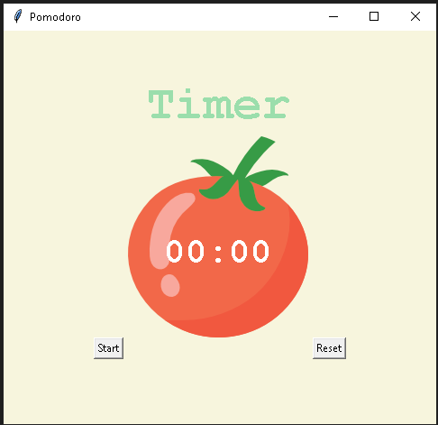
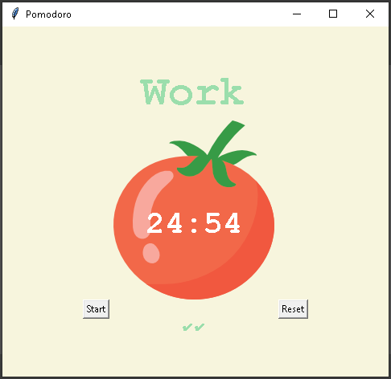

# Pomodoro

Working with:
- Tkinter (Canvas widget)
- IDE: PyCharm

Description:
Project inspired by the Pomodoro technique, which allows you to effectively manage work/study time and duties. The program works as a timepiece that counts down four 25-minute periods of working time (pomodoros), short (5-minute) breaks and one longer (20-minute) break after the last task. A green checkmarks  appears after the end of each work period. The user interface of the program was created with a Canvas widget that provides graphical tools for Tkinter.

Screenshots:

